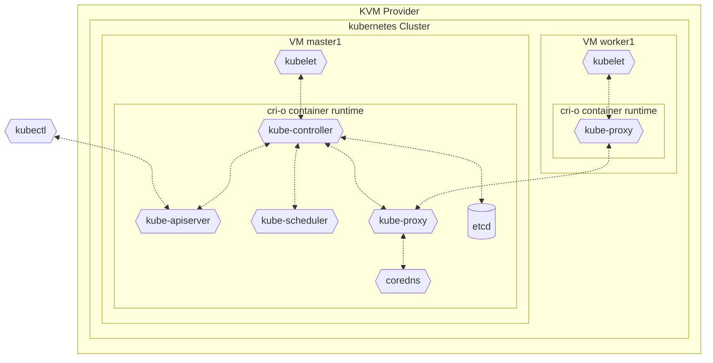
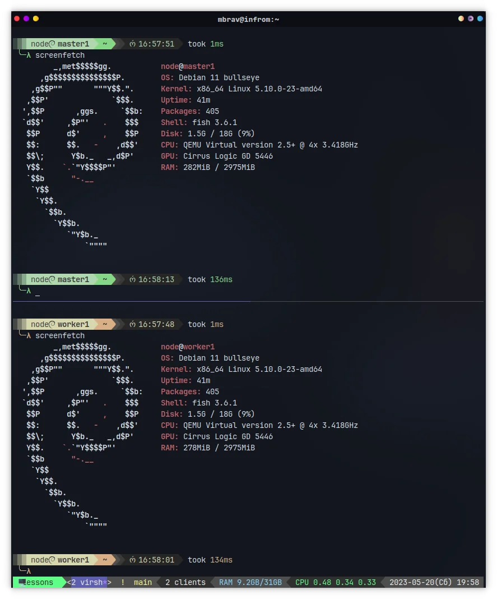

# 01 - Kubernetes from Scratch

In this tutorial we will demystify the process of bootstrapping a Kubernetes cluster by understanding the bare-minimum components that are required to get two Kubernetes nodes running inside KVM.

## Articles

- **dev.to** [*Kubernetes from Scratch: Bootstrapping a Cluster*](https://dev.to/mbrav/kubernetes-from-scratch-bootstrapping-a-cluster-1bd5) - 🌐 English
- **dev.to** [*Поднимаем Kubernetes с нуля*](https://habr.com/ru/articles/734928/) - 🌐 Russian

## Terraform Diagram

This is a rough diagram describing the components



## Screenshot



## Installation

1. Init Terraform
   ```bash
   terraform init
   ```

2. Apply Terraform
   ```bash
   terraform apply
   ```
