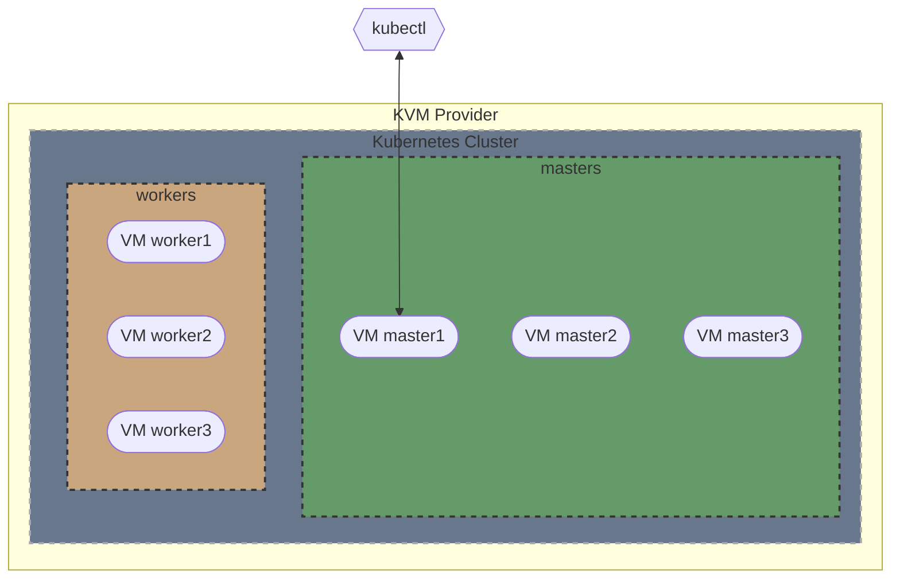

# 02 - Kubernetes from Scratch - Part 2

In this tutorial we will demystify the process of bootstrapping a Kubernetes cluster by understanding the bare-minimum components that are required to get two Kubernetes nodes running inside KVM.

## Articles

- ... - 🌐 English
- ... - 🌐 Russian

## Terraform Diagram

...



<!-- 
## Screenshot

 
-->

## Installation

1. Init Terraform
   ```bash
   terraform init
   ```

2. Apply Terraform
   ```bash
   terraform apply
   ```

3. Follow the kubernetes bootstrapping procedure described in [my articles](#articles)
