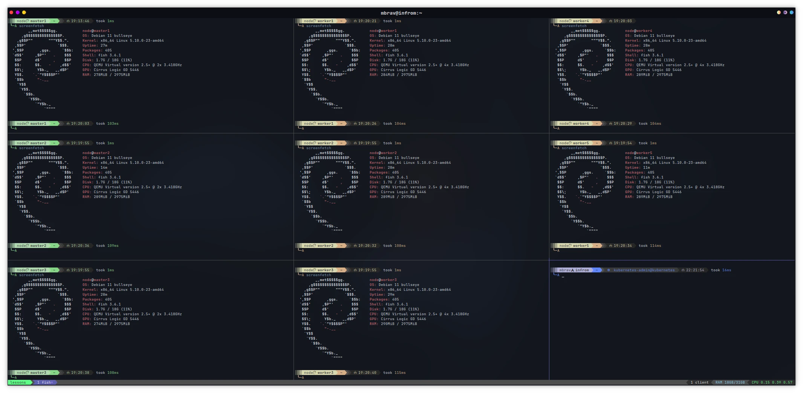

# 02 - Kubernetes from Scratch: Stacked High Availability

In this tutorial we will continue setting a Kubernetes cluster, but this time with high availability in mind.

## Articles

- ... - 🌐 English
- ... - 🌐 Russian

## Diagram


...
<!-- 

```mermaid
flowchart

    kubectl{{kubectl}}

    kubectl ->|REST| master_1

    subgraph KVM Provider
        subgraph k8s[Kubernetes Cluster]

            subgraph masters[Masters]
                master_1([VM master1])
                master_2([VM master2])
                master_3([VM master3])
            end

            subgraph workers[Workers]
                direction TB
                worker_1([VM worker1])
                worker_2([VM worker2])
                worker_3([VM worker3])
            end

            masters <-.-> workers
        end

        style masters fill:#659b68,stroke:#333,stroke-width:2px,stroke-dasharray: 5 5
        style workers fill:#CAA67F,stroke:#333,stroke-width:2px,stroke-dasharray: 5 5
        style k8s fill: #69778c,stroke:#aaa,stroke-width:2px,stroke-dasharray: 5 5
    end
``` 
-->

## Screenshot



## Installation

1. Init Terraform
   ```bash
   terraform init
   ```

2. Apply Terraform (with no parallelism to avoid potential `429` Errors)
   ```bash
   terraform apply -parallelism=1
   ```

3. Follow the kubernetes bootstrapping procedure described in [my articles](#articles)
